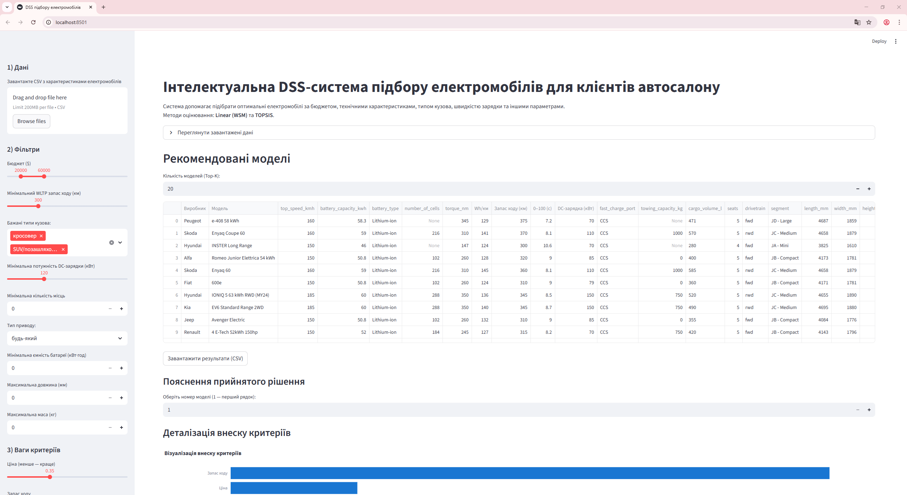
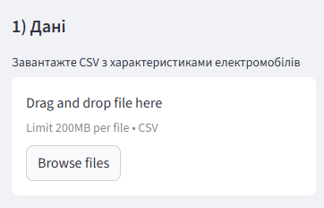
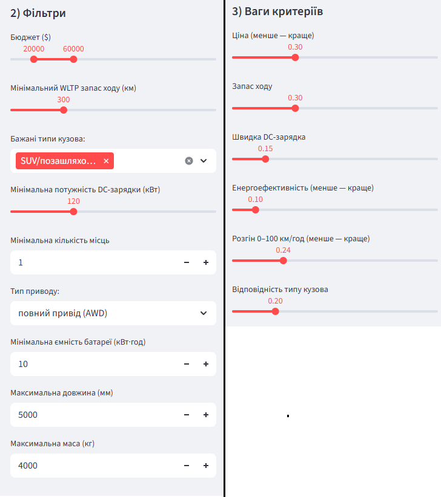
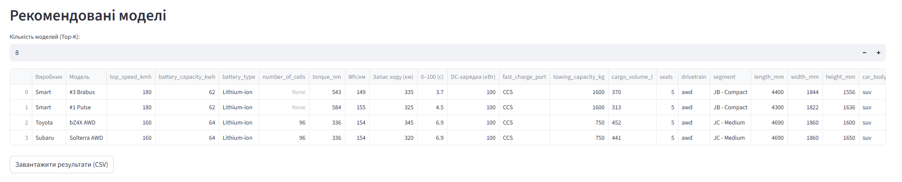
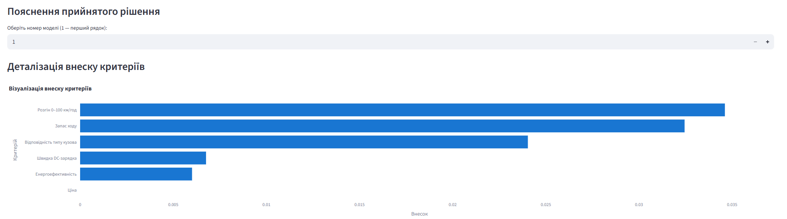
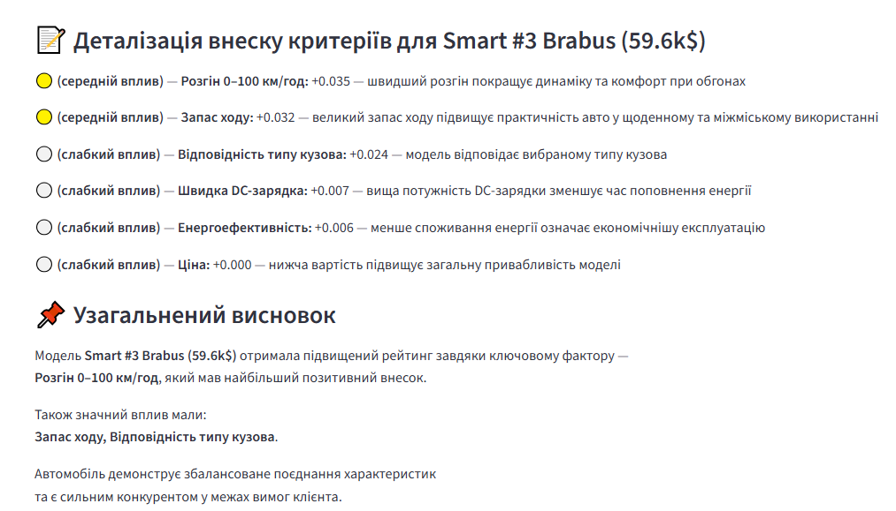

# Інтелектуальна система підбору електромобілів для клієнтів автосалону

Інтелектуальна DSS-система підтримки прийняття рішень для автоматизованого підбору електромобілів за технічними, економічними та користувацькими критеріями.

## Про проект

**Кваліфікаційна робота** на здобуття ступеня магістра  
Спеціальність: 122 «Комп’ютерні науки»  
Освітньо-професійна програма: «Управління інформацією та аналітика даних»  
Національний університет харчових технологій (НУХТ), Київ, 2026

**Тема роботи:** Інтелектуальна система підбору електромобілів для клієнтів автосалону

## Основні можливості системи

- Багатокритеріальне оцінювання електромобілів за допомогою методів **WSM** та **TOPSIS**
- Гнучке налаштування вагових коефіцієнтів критеріїв
- Автоматична нормалізація та обробка даних
- Пояснюваність рішень (explainability) — візуалізація внеску кожного критерію
- Інтерактивний веб-інтерфейс на Streamlit
- Фільтри за бюджетом, запасом ходу, типом кузова, приводом та іншими параметрами
- Порівняння альтернатив та візуалізація результатів

## Використані технології

- **Python + Streamlit** — веб-інтерфейс
- **Pandas, NumPy** — обробка даних
- **Scikit-learn** — нормалізація та допоміжні алгоритми
- **Plotly** — інтерактивна візуалізація
- **WSM + TOPSIS** — методи багатокритеріального аналізу (MCDM)

## Структура репозиторію

- `122_Krupka_Nazar_Serhiyovych_it2026.doc` — текст кваліфікаційної роботи
- `EV_Selection_DSS.zip` — архів з повною програмою (Streamlit-застосунок)
- `screenshots/` — скріншоти інтерфейсу та результатів роботи системи
- `data/` — набір даних, який використовувався для тестування (Electric Vehicle Specifications Dataset 2025)

## Скріншоти системи

**Головне вікно системи**

**Завантаження та перегляд даних**

**Налаштування фільтрів та вагових коефіцієнтів**

**Таблиця рекомендованих моделей електромобілів**

**Візуалізація внеску критеріїв у оцінку**

**Пояснення прийнятого рішення**

**Порівняння методів WSM та TOPSIS**

## Автор

**Крупка Назар Сергійович**  
Магістр спеціальності 122 «Комп’ютерні науки»  
Національний університет харчових технологій (НУХТ), 2026

---

Розроблено в рамках кваліфікаційної роботи магістра.  
Система поєднує сучасні методи багатокритеріального аналізу (MCDM) з інтерактивним веб-інтерфейсом для персоналізованого підбору електромобілів.
